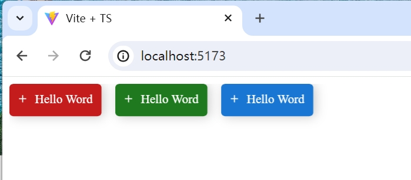

# this is Canvas UI

the canvas ui framework is based on the joy-ui

```
new RexPaperUi(document.getElementById("app")!, {});
new Button({
    text: "Hello Word",
    color: "danger",
    // disable: true,
    startDecorator: pulsIcon,
    point: new Point(0, 0),
});

new Button({
    text: "Hello Word",
    color: "success",
    // disable: true,
    startDecorator: pulsIcon,
    point: new Point(120, 0),
});

new Button({
    text: "Hello Word",
    color: "primary",
    // disable: true,
    startDecorator: pulsIcon,
    point: new Point(240, 0),
});
```


